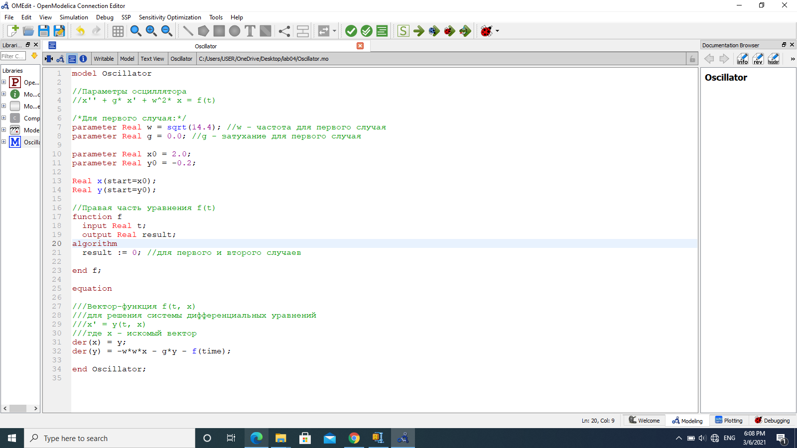
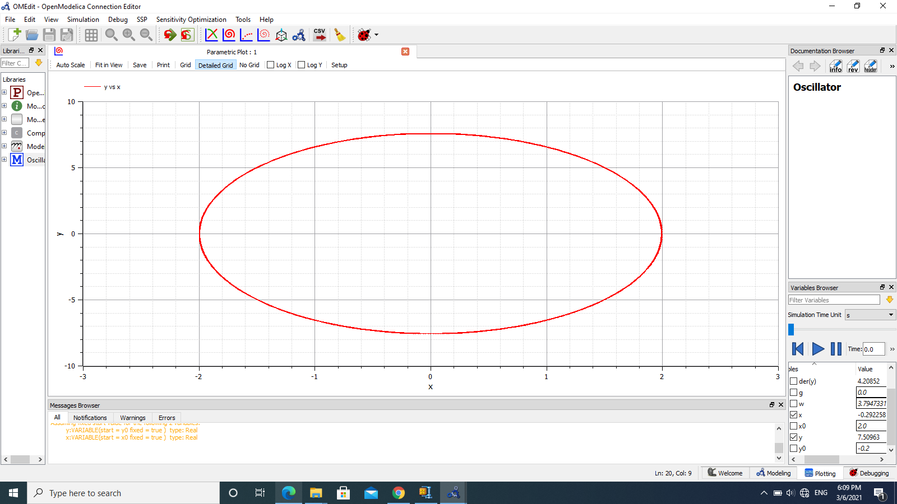
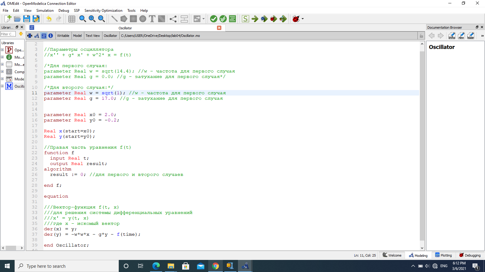
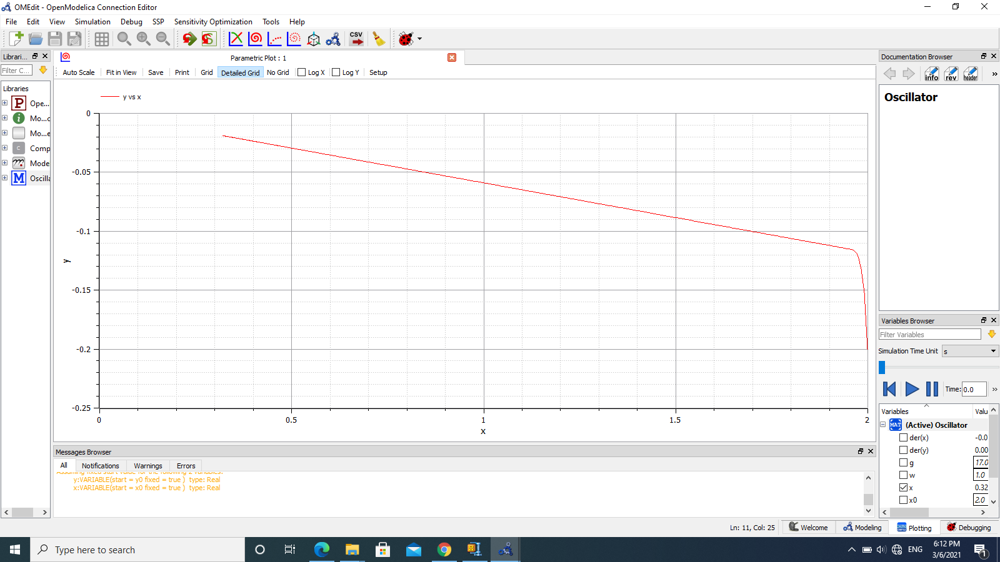
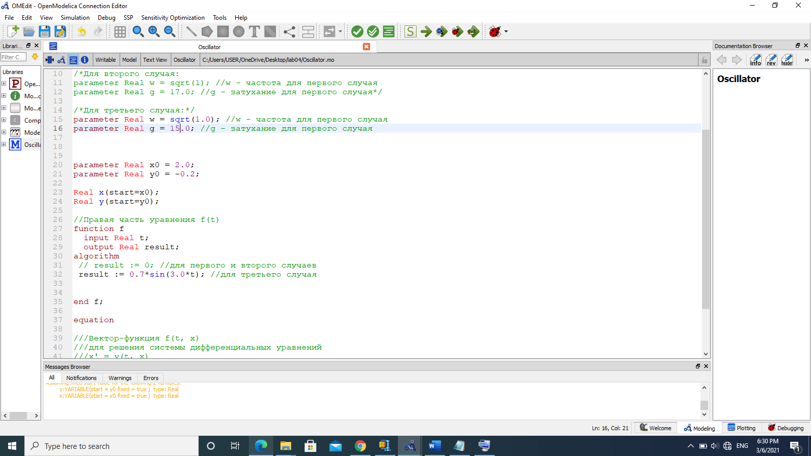
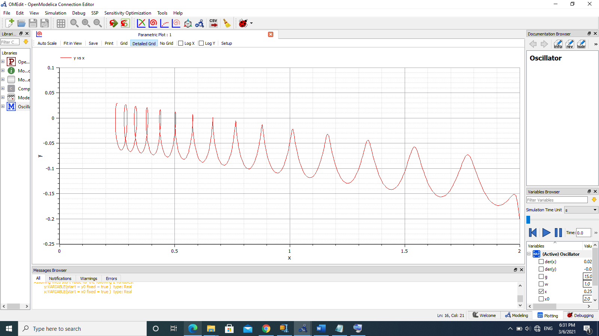

---
# Front matter
lang: ru-RU
title: "Лабораторная работа №4"
subtitle: "Модель гармонических колебаний"
author: "Алли Мохамед Заян"

# Formatting
toc-title: "Содержание"
toc: true # Table of contents
toc_depth: 2
lof: true # List of figures
lot: true # List of tables
fontsize: 12pt
linestretch: 1.5
papersize: a4paper
documentclass: scrreprt
polyglossia-lang: russian
polyglossia-otherlangs: english
mainfont: PT Serif
romanfont: PT Serif
sansfont: PT Sans
monofont: PT Mono
mainfontoptions: Ligatures=TeX
romanfontoptions: Ligatures=TeX
sansfontoptions: Ligatures=TeX,Scale=MatchLowercase
monofontoptions: Scale=MatchLowercase
indent: true
pdf-engine: lualatex
header-includes:
  - \linepenalty=10 # the penalty added to the badness of each line within a paragraph (no associated penalty node) Increasing the value makes tex try to have fewer lines in the paragraph.
  - \interlinepenalty=0 # value of the penalty (node) added after each line of a paragraph.
  - \hyphenpenalty=50 # the penalty for line breaking at an automatically inserted hyphen
  - \exhyphenpenalty=50 # the penalty for line breaking at an explicit hyphen
  - \binoppenalty=700 # the penalty for breaking a line at a binary operator
  - \relpenalty=500 # the penalty for breaking a line at a relation
  - \clubpenalty=150 # extra penalty for breaking after first line of a paragraph
  - \widowpenalty=150 # extra penalty for breaking before last line of a paragraph
  - \displaywidowpenalty=50 # extra penalty for breaking before last line before a display math
  - \brokenpenalty=100 # extra penalty for page breaking after a hyphenated line
  - \predisplaypenalty=10000 # penalty for breaking before a display
  - \postdisplaypenalty=0 # penalty for breaking after a display
  - \floatingpenalty = 20000 # penalty for splitting an insertion (can only be split footnote in standard LaTeX)
  - \raggedbottom # or \flushbottom
  - \usepackage{float} # keep figures where there are in the text
  - \floatplacement{figure}{H} # keep figures where there are in the text
---

# Цель работы

Ознакомление с моделью линейного гармонического осциллятора  и ее построение с помощью языка программирования Modelica. 

# Задание

1. Построить фазовый портрет гармонического осциллятора и решенить уравнения гармонического осциллятора без затуханий и без действий внешней силы.
2. Построить фазовый портрет гармонического осциллятора и решенить уравнения гармонического осциллятора с затуханием и без действий внешней силы.
3. Построить фазовый портрет гармонического осциллятора и решенить уравнения гармонического осциллятора с затуханием и под действием внешней силы.

# Выполнение лабораторной работы

Уравнение свободных колебаний гармонического осциллятора имеет следующий вид:
$$ \ddot {x} + \gamma \dot {x} + w_0^2x = f(t) $$
$x$ — переменная, описывающая состояние системы (смещение грузика, заряд конденсатора и т.д.)
$t$ — время
$w$ — частота
$\gamma$ — затухание  
Интервал: $t \in [0; 31]$ (шаг 0.05).  
Начальные условия: $x_0 = 2, y_0 = -0.2$  

1. Уравнение гармонического осциллятора без затухания и без действия внешней силы:  
$$ \ddot {x} + 14.4x = f(t) $$
где  
$w = \sqrt{14.4}$  
$\gamma = 0.0$  
$f(t) = 0.0$  
Ниже представлен код программы для первого случая, выполненный на языке программирования Modelica. (рис 1. -@fig:001)  

{ #fig:001 width=70% }  

Также ниже представле график для первого случая. (рис 2. -@fig:001)  

{ #fig:001 width=70% }    

2. Уравнение гармонического осциллятора с затуханием и без действия внешней силы:  
$$ \ddot {x} + 17 \dot {x} + x = 0 $$
где  
$w = \sqrt{1.0}$  
$\gamma = 17.0$  
$f(t) = 0.0$  
Ниже представлен код программы для второго случая, выполненный на языке программирования Modelica. (рис 3. -@fig:001)  

{ #fig:001 width=70% }  

Также ниже представле график для второго случая. (рис 4. -@fig:001)  

{ #fig:001 width=70% }    

3. Уравнение гармонического осциллятора с затуханием и под действием внешней силы:  
$$ \ddot {x} + 15 \dot {x} + x = 0.7sin(3t) $$
где  
$w = \sqrt{1.0}$  
$\gamma = 15.0$  
$f(t) = 0.7sin(3t)$  
Ниже представлен код программы для третьего случая, выполненный на языке программирования Modelica. (рис 5. -@fig:001)  

{ #fig:001 width=70% }  

Также ниже представле график для третьего случая. (рис 6. -@fig:001)  

{ #fig:001 width=70% }  

Приведу полный код программы (Modelica):    
model Oscillator
//Параметры осциллятора
//x'' + g* x' + w^2* x = f(t)
//Для первого случая:/*/
parameter Real w = sqrt(14.4); //w - частота для первого случая
parameter Real g = 0.0; //g - затухание для первого случая*/
//Для второго случая:
//parameter Real w = sqrt(1); //w - частота для первого случая
//parameter Real g = 17.0; //g - затухание для первого случая*/
//Для третьего случая:
//parameter Real w = sqrt(1.0); //w - частота для первого случая
//parameter Real g = 15.0; //g - затухание для первого случая
parameter Real x0 = 2.0;
parameter Real y0 = -0.2;
Real x(start=x0);
Real y(start=y0);

//Правая часть уравнения f(t)
function f
  input Real t;

  output Real result;
algorithm
  result := 0; //для первого и второго случаев
//result := 0.7*sin(3.0*t); //для третьего случая
end f;
equation
//Вектор-функция f(t, x)
//для решения системы дифференциальных уравнений
//x' = y(t, x)
//где x - искомый вектор
der(x) = y;
der(y) = -w*w*x - g*y - f(time);
end Oscillator;

# Выводы

Ознакомился с моделью линейного гармонического осциллятора, решив уравнения гармонического осциллятора и построив его фазовые портреты.
